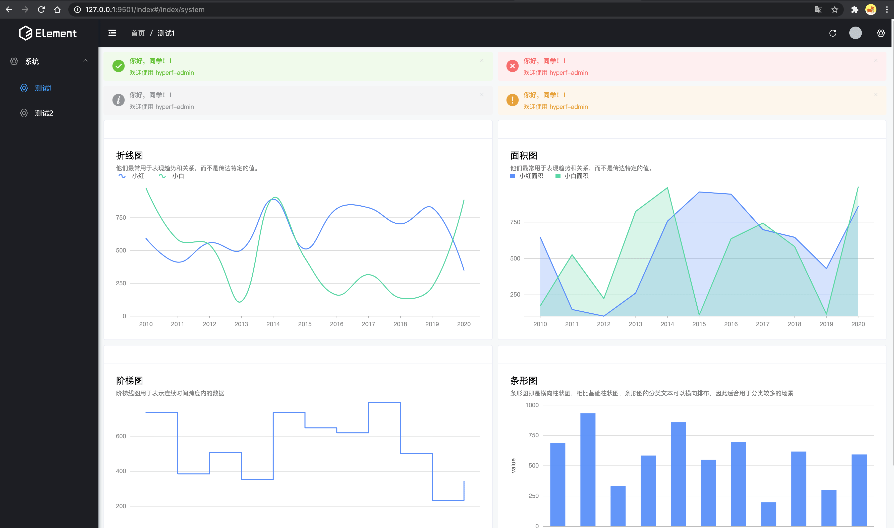
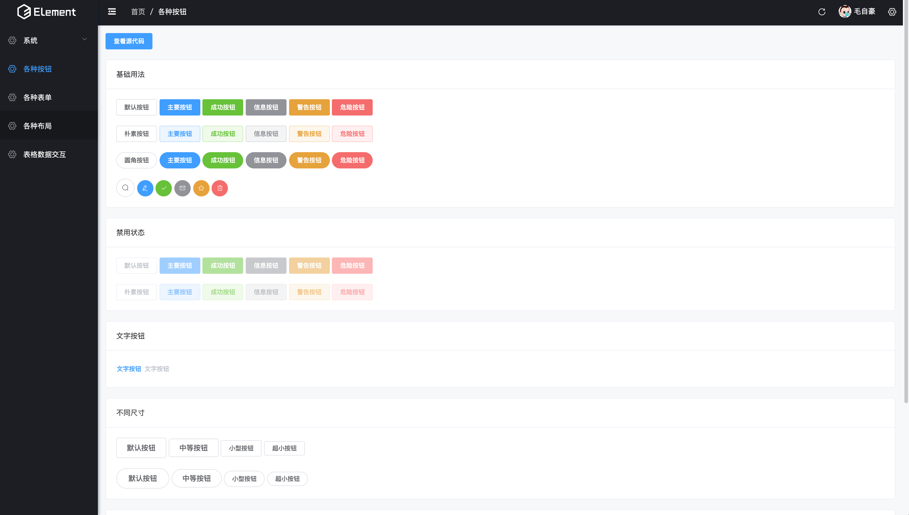
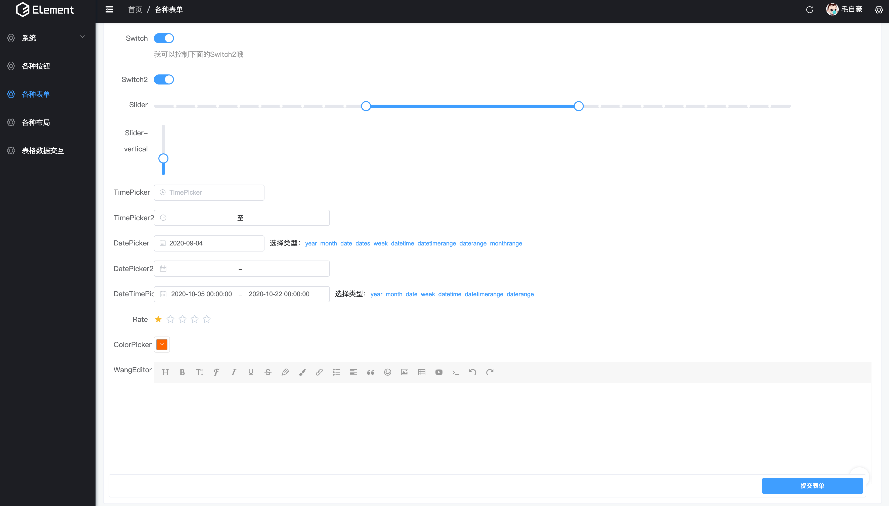
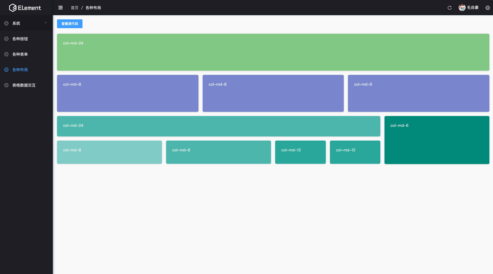
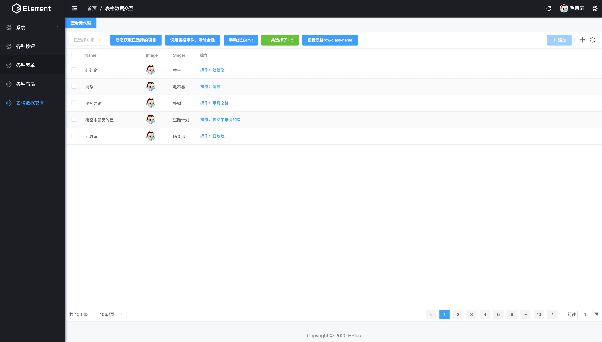

## 喜欢的请点个star！
## HPlus，基于hyperf、element UI 插件式快速开发框架
## UI插件文档
    https://www.yuque.com/hyperf-plus/ui/hplus-ui

### HPlus UI 以插件形式接入，基于此插件可实现各种页面功能开发 ，也可以自定义组件、
- UI插件  composer require hyperf-plus/ui:~1.0
- 权限插件（开发中） composer require hyperf-plus/permissions:~1.0
- 更多开发中...

### 安装方法：
``` bash
    composer require hyperf-plus/ui:~1.0

    php bin/hyperf.php ui:init  初始化静态文件。

    有特殊定制用户可以修改 根目录下的resources/vue项目文件，如有只需要基本页面可以忽略vue文件
```

在该命令会将resources/ui/vue文件拷贝到您的项目根目录（方便特殊定制），static资源拷贝到web 目录：
### 使用

#### 1、快速创建demo示例
下面是一个简单使用的代码示例

#####   (1)、创建资源控制器入口（一个项目只需创建一次即可）
    可以用命令gen:ui-demo
```php
    php bin/hyperf.php gen:ui-demo  创建UI控制器演示文件。
```
#####   (2)、启动hyperf 访问 http://127.0.0.1:9501/ui/index#/index/system

#### 2、或者手动创建请求入口（一个项目只需创建一次即可）
```php
  /**
   可以用注解路由、配置路由注册此方法
   **/
  public function index()
    {
        #创建测试菜单  可以从你自己的数据库拉出菜单结构，但必须是以下结构
        $menuList = [
            [
                "id" => 2,
                "parent_id" => 0,
                "order" => 0,
                "title" => "系统",
                "icon" => "el-icon-setting",
                "uri" => "system",
                "route" => "/index",
                "children" => [
                    [
                        "id" => 2,
                        "parent_id" => 0,
                        "order" => 0,
                        "title" => "测试1",
                        "icon" => "el-icon-setting",
                        "uri" => "system",
                        "route" => "/index/system"
                    ], [
                        "id" => 3,
                        "parent_id" => 0,
                        "order" => 0,
                        "title" => "测试2",
                        "icon" => "el-icon-setting",
                        "uri" => "system",
                        "route" => "/index/test"
                    ],
                ]
            ]
        ];

        # 可以用以上方法添加，也可以用对象方式添加
        $user = new UserEntity();
        $menuItem = new MenuItemEntity();
        $menuItem->setIcon('el-icon');
        $menuItem->setRoute('/index/button');
        $menuItem->setTitle('各种按钮');
        $menu->addMenu($menuItem);
        # ....添加更多
        //创建测试用户信息
        $user = new UserEntity();
        $user->setId(1);
        $user->setUsername('admin');
        $user->setName('毛自豪');
        $user->setAvatar('https://wx.qlogo.cn/mmopen/vi_32/ajNVdqHZLLBpqXMk6kUC4PeB5VrIVtHyUqrcPg65sjKdPxlkBINiaQ1NG6nZC9iaWOh9qdO6VaApJzgWA1wu5h8Q/132');

        #创建UI配置文件
        $setting = new UISettingEntity();
        #设置用户信息
        $setting->setUser($user);
        #设置菜单信息
        $setting->setMenu($menu);

        #设置底部链接
        $setting->setUrl([
            'logout' => route('admin/logout'),
            'setting' => route('admin/setting')
        ]);
        return UI::view($setting);
    }
```
可以用 <a href="https://github.com/lphkxd/hyperf-ui-plugin/blob/master/demo.php">demo.php</a> 创建个控制器 /app/Controller/IndexController.php 体验一下
### 访问 http://127.0.0.1:9501/index/index#/index/system

### demo控制器例子
<a href="https://github.com/lphkxd/hyperf-ui-plugin/blob/master/demo.php">查看例子源码</a>
##### 通过以上代码实现如下界面






官网： http://hyperf.plus（建设中）

#### 欢迎加入hyperf.plus交流群，群聊号码：512465490
点击链接加入群聊【hyperf-plus交流群】：<a href="https://qm.qq.com/cgi-bin/qm/qr?k=pCkT8bLR-scfzGhiLYAu2AuEu5pzOfdD&authKey=0L9w5QrmZJQpDdaH9R5WpPK5mUPyh1RiM3nqcRggpMpM8heAgBBXWdzuk9zkyRko&noverify=0">群聊号码：512465490</a>
<p align="center">
    <a href="https://github.com/lphkxd/hyperf-admin/releases"></a>
    <a href="https://travis-ci.org/mzh/hyperf-admin-plugin"></a>
    <a href="https://packagist.org/packages/mzh/hyperf-admin-plugin"></a>
    <a href="https://packagist.org/packages/mzh/hyperf-admin-plugin"></a>
    <a href="https://www.php.net"></a>
    <a href="https://github.com/swoole/swoole-src"></a>
    <a href="https://github.com/lphkxd/hyperf-admin-plugin/blob/master/LICENSE"></a>
</p>

#### 以插件形式开箱即用
#### 喜欢的帮忙点个star
## 鸣谢：
-  https://github.com/SmallRuralDog/laravel-vue-admin

